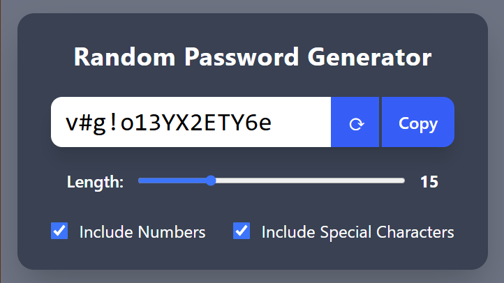

# 🔐 Random Password Generator

A sleek, responsive **Random Password Generator** built with **React** and **Tailwind CSS**. Instantly create secure passwords with options to include numbers, special characters, and customize length — all in a smooth, mobile-friendly UI.

---

## 🚀 Features

- ✅ Real-time password generation
- 🔢 Adjustable password length (6–40 characters)
- 🔣 Toggle options for:
  - Numbers (0–9)
  - Special characters (!@#$%^&*, etc.)
- 📋 One-click copy to clipboard
- 🔁 Refresh button for instant regeneration
- 📱 Fully responsive design for mobile & desktop
- 🎨 Styled with Tailwind CSS and React best practices

---

## 🖼️ Preview

---

## 🛠️ Tech Stack

- [React](https://reactjs.org/)
- [Tailwind CSS](https://tailwindcss.com/)
- [Vite](https://vitejs.dev/)

---

## 📄 License
MIT License. Feel free to use, fork, and contribute!